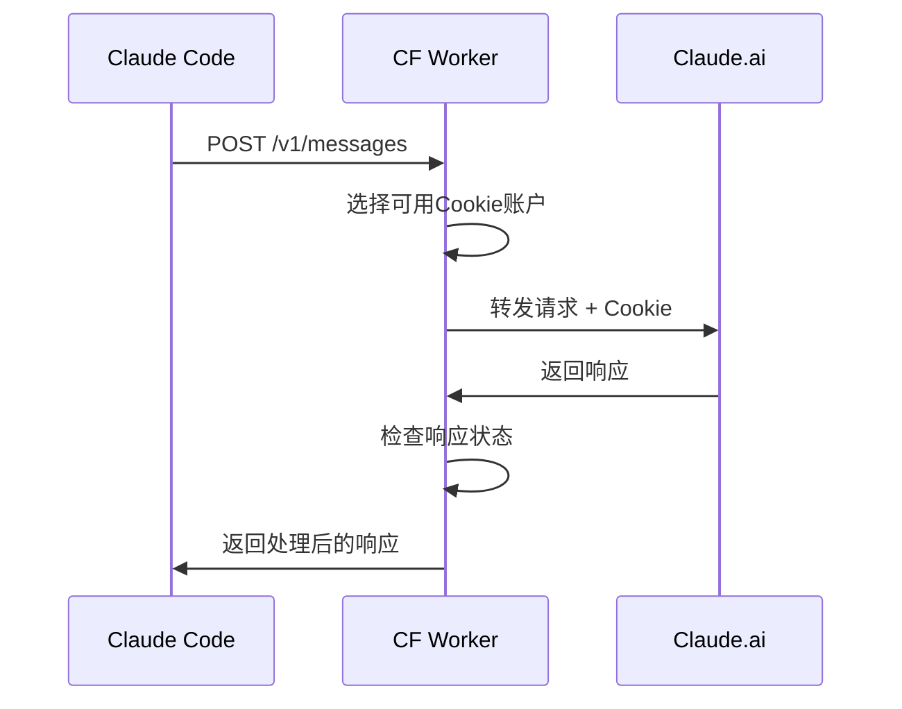

# Claude Relay Worker - Cookie模式实施计划

> **目标**: 为Claude Relay Worker添加Cookie认证模式支持，实现与现有OAuth模式的双模式兼容

---

## 📋 项目概况

### 当前状态分析
- ✅ **已完成**: OAuth认证模式
- ✅ **已有架构**: 模块化ES6结构，KV存储，CORS支持
- 🔄 **待添加**: Cookie认证模式，管理页面，双模式集成

### 目标功能
1. **Cookie管理页面** - 添加、编辑、删除Cookie账户
2. **Cookie代理逻辑** - 处理基于Cookie的Claude.ai API请求
3. **双模式支持** - OAuth和Cookie模式的统一管理
4. **负载均衡** - 多Cookie账户的智能分配
5. **状态监控** - Cookie有效性检测和账户状态管理

---

## 🏗️ 架构设计

### 文件结构扩展
```
src/
├── index.js          # 主路由 (扩展Cookie路由)
├── auth.js           # OAuth认证 (已有)
├── cookie.js         # Cookie认证 (新增)
├── api.js            # API代理 (扩展Cookie支持)
├── templates.js      # HTML模板 (扩展Cookie页面)
├── utils.js          # 工具函数 (扩展Cookie工具)
├── config.js         # 配置 (扩展Cookie配置)
└── accountManager.js # 账户管理器 (新增)
```

### 数据存储设计

#### KV Storage Schema
```javascript
// OAuth令牌 (已有)
'claude_token' => {
  access_token: "...",
  refresh_token: "...", 
  expires_at: timestamp,
  // ...
}

// Cookie账户列表 (新增)
'cookie_accounts' => {
  accounts: [
    {
      id: "uuid",
      name: "账户名称",
      cookie: "sessionKey=...",
      status: "active|invalid|rate_limited",
      last_used: timestamp,
      created_at: timestamp,
      usage_count: number,
      rate_limit_reset: timestamp|null
    }
  ],
  last_updated: timestamp
}

// 账户使用统计 (新增)
'account_stats' => {
  oauth: { requests: 0, errors: 0, last_used: null },
  cookies: { 
    total_requests: 0,
    active_accounts: 0,
    last_rotation: timestamp
  }
}
```

---

## 🚀 实施阶段

### Phase 1: 核心Cookie管理功能
**优先级**: 🔴 高 | **预估时间**: 2-3小时

#### 1.1 创建Cookie管理器
- [ ] `src/cookie.js` - Cookie账户CRUD操作
- [ ] Cookie验证和状态检测
- [ ] 账户轮换和负载均衡逻辑

#### 1.2 扩展配置和工具
- [ ] `src/config.js` - 添加Cookie相关配置
- [ ] `src/utils.js` - Cookie解析和验证工具
- [ ] 错误处理和日志记录

#### 1.3 KV存储操作
- [ ] Cookie账户数据的增删改查
- [ ] 账户状态更新和持久化
- [ ] 数据迁移和版本兼容

### Phase 2: Cookie管理页面
**优先级**: 🔴 高 | **预估时间**: 3-4小时

#### 2.1 HTML模板扩展
- [ ] `src/templates.js` - Cookie管理页面模板
- [ ] 账户列表展示组件
- [ ] 添加/编辑Cookie表单
- [ ] 状态指示器和操作按钮

#### 2.2 前端交互逻辑
- [ ] Cookie账户的添加和删除
- [ ] 实时状态更新和验证
- [ ] 批量操作和导入导出
- [ ] 响应式设计和移动端适配

#### 2.3 页面路由扩展
- [ ] `src/index.js` - 添加Cookie管理路由
- [ ] RESTful API接口设计
- [ ] 权限控制和访问保护

### Phase 3: API代理逻辑扩展
**优先级**: 🟡 中 | **预估时间**: 2-3小时

#### 3.1 扩展API处理器
- [ ] `src/api.js` - 支持Cookie认证模式
- [ ] 请求头处理和Cookie注入
- [ ] 响应处理和错误映射

#### 3.2 认证模式路由
- [ ] 智能认证模式选择逻辑
- [ ] OAuth失败时的Cookie降级
- [ ] 账户可用性实时检测

#### 3.3 负载均衡和容错
- [ ] Cookie账户的轮换策略
- [ ] 失败重试和账户标记
- [ ] 性能监控和统计

### Phase 4: 双模式集成和优化
**优先级**: 🟡 中 | **预估时间**: 2小时

#### 4.1 统一认证管理
- [ ] `src/accountManager.js` - 统一账户管理器
- [ ] OAuth和Cookie的统一接口
- [ ] 认证模式优先级和策略

#### 4.2 监控和诊断
- [ ] 账户健康检查机制
- [ ] 使用统计和性能指标
- [ ] 错误追踪和告警

#### 4.3 用户体验优化
- [ ] 统一的管理界面
- [ ] 模式切换和配置向导
- [ ] 帮助文档和故障排除

---

## 🔧 技术实现细节

### Cookie认证流程


### 负载均衡策略
1. **轮询分配**: 依次使用可用账户
2. **最少使用**: 优先使用使用次数最少的账户
3. **健康优先**: 避免使用近期出错的账户
4. **速率限制避让**: 跳过被限流的账户

### 错误处理机制
- **401 Unauthorized**: 标记Cookie无效，切换账户
- **429 Rate Limited**: 记录限流时间，暂时跳过
- **5xx Server Error**: 重试机制，最多3次
- **网络错误**: 降级到备用账户

---

## 📋 开发清单

### 立即执行 (Phase 1)
- [ ] 创建 `src/cookie.js` - Cookie管理核心逻辑
- [ ] 扩展 `src/config.js` - 添加Cookie配置项
- [ ] 更新 `src/utils.js` - Cookie解析工具函数
- [ ] 设计KV存储结构和数据模型

### 短期目标 (Phase 2)
- [ ] 扩展 `src/templates.js` - Cookie管理页面HTML
- [ ] 更新 `src/index.js` - 添加Cookie路由处理
- [ ] 实现Cookie账户的CRUD API接口
- [ ] 前端交互逻辑和状态管理

### 中期目标 (Phase 3-4)
- [ ] 扩展 `src/api.js` - 支持Cookie代理逻辑
- [ ] 实现负载均衡和容错机制
- [ ] 统一认证管理和模式切换
- [ ] 监控、统计和优化功能

---

## 🧪 测试策略

### 单元测试
- Cookie解析和验证逻辑
- 账户状态管理功能
- 负载均衡算法正确性

### 集成测试
- Cookie代理端到端流程
- 双模式切换和兼容性
- 错误处理和恢复机制

### 压力测试
- 多Cookie账户并发处理
- 高频请求下的性能表现  
- 内存使用和KV操作优化

---

## 📚 参考资料

### Claude.ai API相关
- Cookie格式: `sessionKey=sk-ant-sid01-...`
- 请求头要求: User-Agent, Referer等
- 错误响应格式和状态码含义

### Cloudflare Workers
- KV Storage最佳实践
- 请求处理性能优化
- CORS和安全配置

### 现有Clove实现
- `app/services/account.py` - 账户管理参考
- `app/core/account.py` - 数据模型参考
- 错误处理和日志记录模式

---

## 🎯 成功指标

### 功能完整性
- ✅ Cookie账户增删改查100%可用
- ✅ 双模式无缝切换和兼容
- ✅ 负载均衡和容错机制正常运行

### 性能要求
- 🎯 单请求处理时间 < 200ms
- 🎯 Cookie账户切换延迟 < 50ms
- 🎯 KV操作响应时间 < 100ms

### 用户体验
- 🎯 管理界面直观易用
- 🎯 错误信息清晰可操作
- 🎯 移动端适配完整

---

**下一步行动**: 开始Phase 1的实施，创建Cookie管理核心功能。